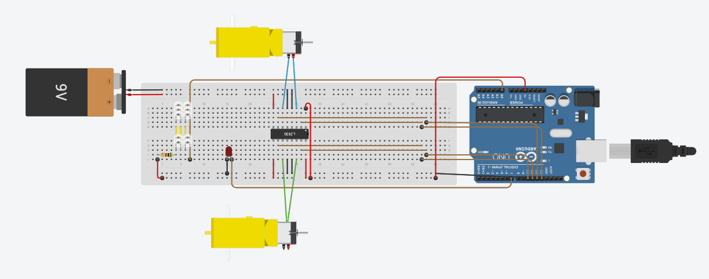

# 🎮 Projet Ball-Bot - TIPE 2024  

Reproduction du jeu vidéo **Rocket League®** en version réelle, avec deux voitures télécommandées équipées de lasers pour immobiliser l’adversaire.  

---

## 🚗 Fonctionnalités  
✅ Contrôle via Bluetooth.  
✅ Tir laser pour immobiliser l’adversaire.  
✅ Détection via phototransistors (récepteur).  
✅ Elargissement du faisceau laser pour balayer l'entièreté du récepteur.

---

## 🛠️ Technologies utilisées  
| Composant        | Rôle                         |
|----------------|-----------------------------|
| Arduino Uno    | Contrôle des voitures       |
| Bluetooth HC-05 | Communication sans fil     |
| Pont en H       | Contrôle des moteurs        |
| Laser rouge     | Immobilisation              |
| Phototransistor | Détection                   |
| Lentille optique    | Divergence du faisceau       |

---

## 🔧 Structure du dépôt
```
Ball-Bot/
│
├── Code_Arduino/
│   ├── Code_Arduino_TIPE.ino
│   ├── README.md
│
├── Schematics/
│   ├── Schema_Tinkercad.png
│
├── Documentation/
│   ├── Etude_Lentille.md
│   ├── Explication_Pont_H.md
│   ├── Rapport_TIPE.pdf
│   ├── MCOT_ BALL_BOT_TIPE.pdf
│
├── Images/
│   ├── Photo_Robot.png
│   ├── Video_Demo.mp4
│
└── README.md
```
---

## 📡 Schéma du Circuit  


---

## 📝 Documentation technique
- [🛠️ Explication du Pont en H](Documentation/Explication_Pont_H.md)  
- [🔴 Étude de la lentille pour le laser](Documentation/Etude_Lentille.md)  
- [📄 Rapport TIPE](Documentation/Rapport_TIPE.pdf)
- [📄 MCOT TIPE](Documentation/MCOT_BALL_BOT.pdf)

---

## ✅ Résultats attendus
🔹 Contrôle fluide via Bluetooth  
🔹 Immobilisation de la voiture touchée  
🔹 Robot adapté pour jouer à 2 voitures 

---

## 📂 Structure du projet  

## 👥 Équipe
- Lizo Berger
- Keryann Manuera Vela--Beyer
- Hugo Girard

---
